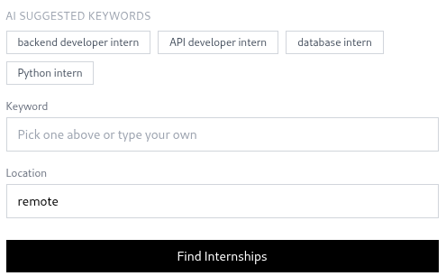
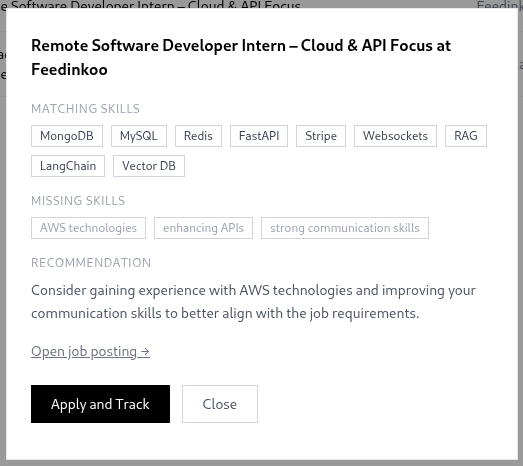
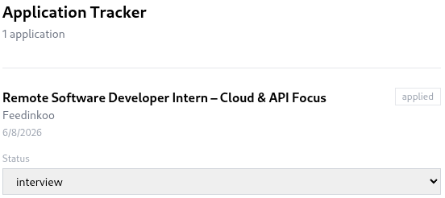

# PitchPath

AI-powered internship finder. Upload your resume → get matched with real internships → track applications.

## How it works

1. **Upload Resume** — PDF is parsed and validated by AI. Skills, experience, and keywords are extracted automatically.
2. **Browse Matches** — AI suggests search keywords based on your resume. Pick one or type your own, add a location, and fetch real listings ranked by similarity to your profile.
3. **Gap Analysis** — Click any job to see matching skills, missing skills, and a personalized recommendation.
4. **Track Applications** — Apply with one click. Update status (applied → interview → offer) from the tracker.

## Stack

- **Backend** — FastAPI, MongoDB, Pinecone (vector search), Upstash Redis (caching)
- **AI** — OpenAI GPT-4o-mini + text-embedding-3-small via LangChain
- **Jobs** — JSearch (RapidAPI) — real listings only, no dummy data
- **Frontend** — Plain HTML + Tailwind CSS

## Screenshots

 

 

---

Built by [Areeba Shakeel](https://github.com/aribatech)
